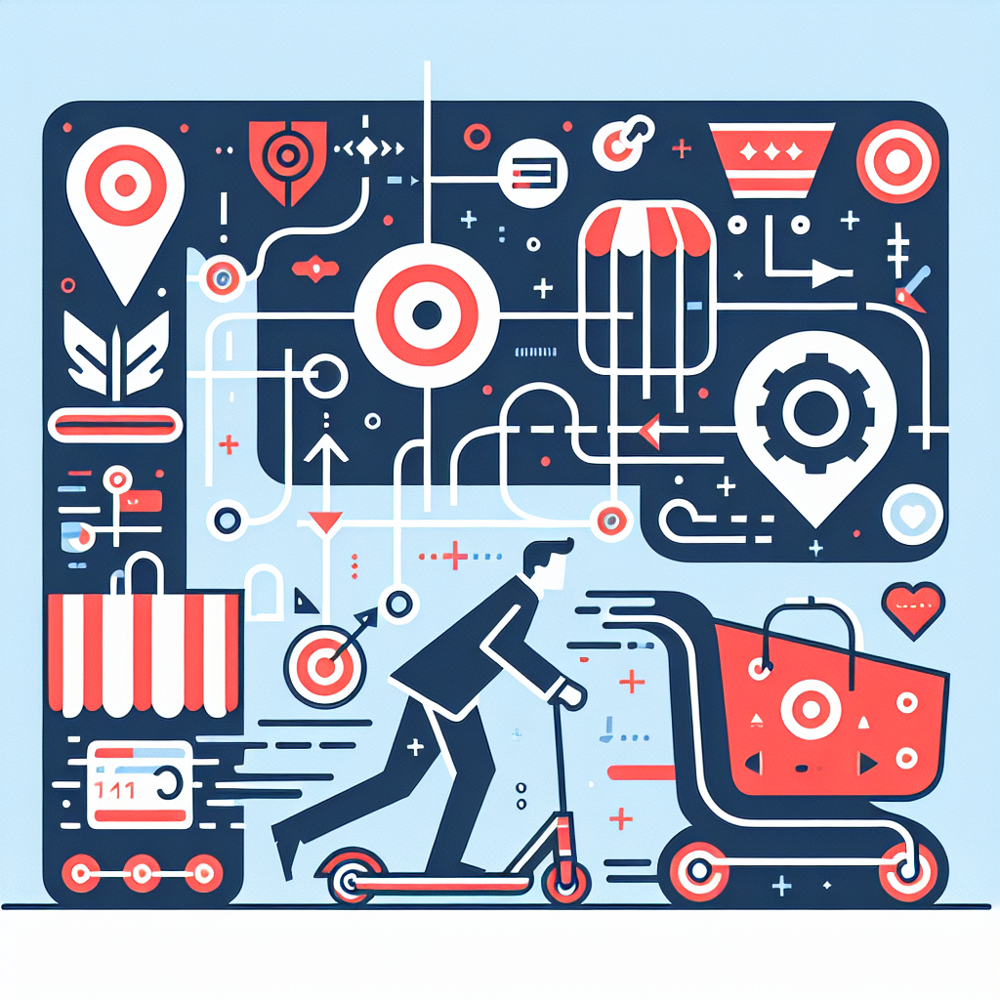

# Arcade Flow Analysis Report

    ## 📊 Flow Overview

    - **Flow Name**: Add a Scooter to Your Cart on Target.com
    - **Flow ID**: 2RnSqfsV4EsODmUiPKoW
    - **Description**: N/A
    - **Total Steps**: 13
    - **Created**: 9/1/2025, 10:06:20 AM
    - **Analysis Date**: 10/18/2025, 12:47:08 PM

    ## 👤 User Interactions

    1. Clicked on the search bar to start looking for a product.

2. Typed in the search term "scooter".
3. Scrolled through the search results.
4. Clicked on the scooter image to learn more about its features and see all available options.
5. Scrolled down the product page.
6. Clicked on the color option for the scooter.
7. Clicked on another color option for the scooter.
8. Clicked on the "Add to cart" button to secure the scooter.
9. Clicked on the "Decline coverage" button for the protection plan.
10. Clicked on the cart icon to review selected items and proceed to checkout.
11. Scrolled through the cart page.

    ## 🎯 Summary

    The user wanted to purchase a scooter from Target.com. After searching for a scooter, reviewing its features and options, and selecting a color, they added it to their cart. The user declined the offer for a protection plan, reviewed their cart, and prepared to proceed to checkout.

    ## 🖼️ Social Media Image

    

    ***

    _Generated with GPT-4o-mini and DALL-E 3_
